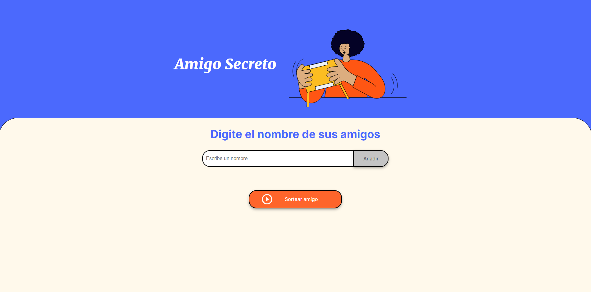

# Amigo Secreto

---

## 📑 Índice

- [Descripción del Proyecto](#descripción-del-proyecto)
- [Cómo usarlo](#cómo-usarlo)
- [Tecnologías utilizadas](#tecnologías-utilizadas)
- [Personas Contribuyentes](#personas-contribuyentes)

---

## 💡 Descripción del Proyecto

En este desafío, desarrollé una aplicación que permite a los usuarios ingresar nombres de amigos en una lista y luego realizar un sorteo aleatorio para determinar quién es el "Amigo Secreto".

El usuario podrá ingresar nombres de amigos mediante un campo de texto y un botón **"Adicionar"**. Los nombres ingresados se mostrarán en una lista visible en la página, y al finalizar, el botón **"Sortear Amigo"** seleccionará uno de los nombres de manera aleatoria y mostrará el resultado en pantalla.

---

## 💻 Cómo usarlo

1. Clona este repositorio o descarga los archivos.
2. Abre el archivo `index.html` en tu navegador.
3. Ingresa un nombre en el campo de texto y haz clic en **"Añadir"**.
4. Repite el paso 3 segun la cantidad de nombres que desees agregar.
5. Haz clic en **"Sortear Amigo"** para seleccionar un amigo al azar.

**Requisitos:**
- Un navegador web moderno (Chrome, Firefox, Safari, Edge).
- Tener habilitado JavaScript en tu navegador.

---

## 🚀 Tecnologías utilizadas

- **HTML5**: Estructura del contenido.
- **CSS3**: Diseño y estilos responsivos.
- **JavaScript**: Lógica de la aplicación y funcionalidad interactiva.

---

## 👥 Personas Contribuyentes

- **Octavio Pino Rosas** - Desarrollador Principal [@OctavioPinoRosas](https://github.com/OctavioPinoRosas)
  
Si deseas contribuir, siéntete libre de abrir un *pull request*.
